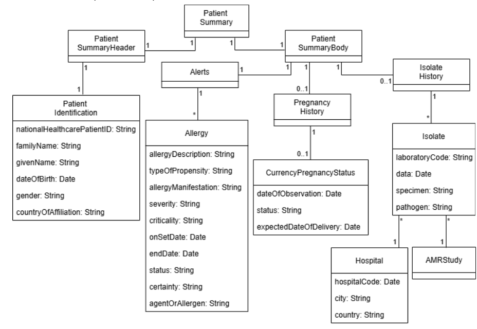

6. Use case

In this subsection, we describe a use case which demonstrates how our approach works properly for onboarding rules for cross-border interoperability of health data. Specifically, our scenario is based on the European Health Data Space (EHDS) and on a strategic cross-border antimicrobial resistance (AMR) surveillance [ref] data space use case. 

The European Health Data Space (EHDS) is one of the flagship initiatives of the European Data Strategy. It establishes a federated, secure, and trust-based infrastructure that enables health data to be shared and reused across Member States. This scenario introduces crucial requirements on data quality, as datasets originally captured in heterogeneous clinical workflows may be used for other purposes. As a result, the EHDS provides an ideal case study to validate our approach.

Health data are generated under diverse national systems, local conventions, and clinical practices. Their primary purpose is to support patient care, not cross-border data reuse. Consequently, datasets collected for primary use often suffer from inherent quality issues when reusing for other purposes: inconsistent coding standards, missing values, temporal inaccuracies, or ambiguous semantics.

AMR is widely recognised as a major public health threat that requires efficient surveillance processes and timely, comparable data to guide infection prevention and control and other evidence-based interventions. At EU level, the European Commission has explicitly framed AMR as a critical risk and has promoted a coordinated "One Health" response, emphasising the need for sustained, concerted action across Member States. Within the EHDS context, the AMR use case can be understood as enabling secondary use of national microbiology datasets for cross-border surveillance (e.g., estimating resistance rates consistently over time and across countries) under a common governance and infrastructure framework.

Under the EHDS framework, Patient Summaries [refPat] represent one of the core information assets provided. It contains key health-related information, including allergies, current medications, past illnesses, surgical history, and other relevant clinical data. Moreover, the inclusion of patient isolate data for antimicrobial resistance monitoring into EHDS supports the formalization of the AMR use case, allowing for standardized and consistent estimation of resistance rates over time and across countries.

Figure XX shows an excerpt of the EHDS’s data model, represented in an UML class diagram, containing entities, attributes and associations for representing a fragment of the Patient Summaries information. Additionally, the data model encompasses information derived from a study investigating antimicrobial resistance profiles using specimens collected from a patient sample.

Figure XX: An excerpt of the EHDS’s data model containing the Patient Summaries information and patient antimicrobial resistance data

The EHDS legislative proposal explicitly highlights the need for harmonised quality criteria covering dimensions such as completeness, accuracy, timeliness, consistency, and provenance [EHR26]. Our proposal can support the EHDS Data Space Governance Authority in eliciting, specifying, and operationalizing DQRs across different dimensions. 

In particular, we illustrate our approach assuming that EHDS Data Space Governance Authority decides, after the elicitation process, to define five DQRs:
DQR1EH: Patients shall be unambiguously identified by their national healthcare patient ID and, therefore, it must not be a null value. (Pattern: https://github.com/feed-upc/DS-DataQualityRequirements/blob/main/media/DQRP2/DQRP2-Completeness.png, DQR1EH: https://github.com/feed-upc/DS-DataQualityRequirements/blob/main/media/DQRP2/DQRP2Instantiation.png)
DQR2EH: Patients affiliation countries must be referenced using country codes (for saving time and errors) from the ISO 3166 International Standard. (Pattern: https://github.com/feed-upc/DS-DataQualityRequirements/blob/main/media/DQRP3/DQRP3-Validity.png, DQR2EH: https://github.com/feed-upc/DS-DataQualityRequirements/blob/main/media/DQRP3/DQRP3Instantiation.png)
DQR3EH: Male patients shall not have any recorded pregnancy history. (Pattern: https://github.com/feed-upc/DS-DataQualityRequirements/blob/main/media/DQRP4/DQRP4-Consistency.png, DQR3EH: https://github.com/feed-upc/DS-DataQualityRequirements/blob/main/media/DQRP4/DQRP4Instantiation.png)
DQR4EH: To obtain reliable estimates of antimicrobial resistance rates, a minimum total sample size of at least 2,000 isolates is required.
DQR5EH: Accurate estimation of antimicrobial resistance rates requires a study population with balanced representation of male and female patients, ideally a 1:1 ratio, to mitigate potential biases arising from the under-representation of women commonly reported in clinical research [Ama25].
DQR6EH: Hospital countries must be referenced using country codes from the ISO 3166 International Standard.

Following the approach described in Section 5.2, the EHDS requirements analyst selects, from the Reference Catalog of DQR Patterns, the pattern corresponding to each elicited DQR. Five distinct patterns are sufficient to specify the six elicited DQRs, since DQR2EH and DQR6EH conform to the same pattern. After pattern selection, the pattern is instantiated to derive the concrete requirement specification, which is then included in the EHDS specific catalog of DQRs. As an illustrative example, Figures XX, YY, and ZZ show, respectively, the pattern applied to define DQR5EH, the instantiation of this requirement, and the corresponding ODRL rule. The specifications of the remaining DQRs are provided in the Reference Catalog of DQR Patterns as examples of pattern instantiations.
